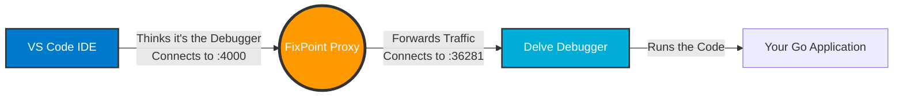
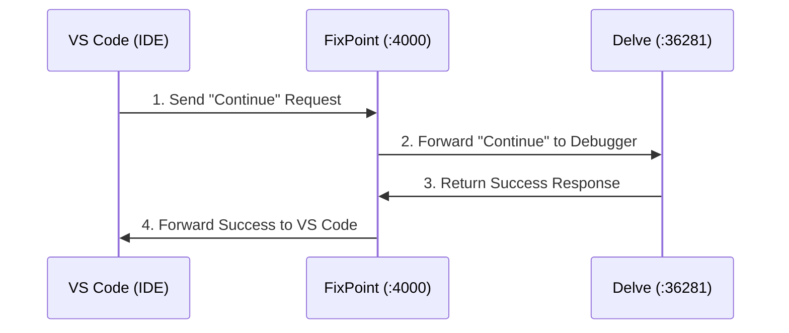
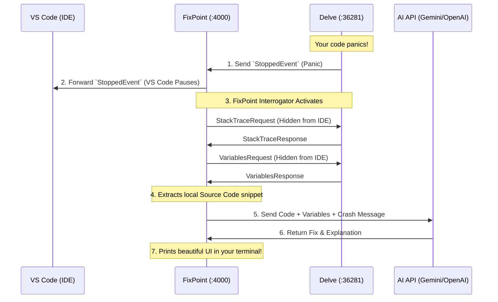

# High Level Design (HLD): FixPoint Architecture

FixPoint acts as a **man-in-the-middle (MITM) proxy** between your Integrated Development Environment (IDE) and your Debug Adapter Protocol (DAP) server (e.g., Go's Delve). 

To a new developer, it's crucial to understand that **VS Code is NOT directly connected to your code's debugger**. Instead, FixPoint sits in the middle, intercepting communication so it can analyze crashes with AI before passing them to you.

---

## 1. The Core Illusion: Ports and Connections

Here is exactly how the setup works across network ports:

1. **The Real Debugger (Delve)** runs on **Port 36281**. It is actively debugging your Go code.
2. **FixPoint (Proxy)** listens on **Port 4000**. It acts as a bridge, connecting to Delve on Port 36281.
3. **VS Code (IDE)** connects to **Port 4000**. It thinks it is talking directly to the debugger, but it is actually talking to FixPoint.

---

## 2. Codebase Organization

Following standard Go project layout conventions:
- **`/cmd/fixpoint`**: Contains the main CLI application entry point (`main.go`). It handles flag parsing, configuration loading, and orchestrating the core logic.
- **`/internal`**: Contains private application logic divided into decoupled domains:
  - **`config`**: Global configuration and persistent storage management.
  - **`models`**: Shared data structures (e.g., `DebugContext`, `VariableInfo`).
  - **`proxy`**: The core TCP proxy Server and DAP Stream Processor.
  - **`ai`**: Integrations with LLM providers for root-cause analysis.
  - **`delve`**: Manages the lifecycle (spawning and killing) of the background `dlv dap` process.
  - **`interrogator`**: Injects hidden requests to fetch stack traces and variables.
  - **`source`**: Reads local source files to extract code snippets for context.
  - **`ui`**: CLI rendering utilities (colors, formatting, spinners).

---

## 3. System Components

### A. The IDE (e.g., VS Code)
The user's code editor. When you click "Start Debugging", it sends commands (like `step over`, `continue`) to Port 4000, expecting standard Debugger responses.

### B. FixPoint (The Proxy)
The core application. It has several sub-components:
- **CLI & Entry Point (`cmd/fixpoint/main.go`)**: Provides the `fixpoint` command line interface, interactive setup, and orchestrates the application startup.
- **Config Manager (`internal/config/config.go`)**: Manages the global JSON configuration (`~/.config/fixpoint/config.json`) so users don't need `.env` files per project.
- **Proxy Server (`internal/proxy/proxy.go`)**: Manages the TCP connections between VS Code and Delve.
- **DAP Stream Processor (`internal/proxy/proxy.go`)**: Reads, parses, and forwards DAP messages back and forth in real-time.
- **Interrogator (`internal/interrogator/interrogator.go`)**: When a crash occurs, this component injects its own hidden requests to Delve to fetch variables, stack traces, and scopes.
- **Source Reader (`internal/source/source.go`)**: Reads your local files to extract the exact code snippet where the crash happened.
- **AI Module (`internal/ai/ai.go`)**: Sends the crash context to LLMs (Gemini, OpenAI) for analysis.

### C. The Debugger (e.g., Delve)
The actual DAP backend. By default, **FixPoint automatically spawns `dlv dap` in the background on an ephemeral port** when you start the proxy. It manages the lifecycle of the `dlv` process, executing your Go code, hitting breakpoints, and triggering `StoppedEvents`. When FixPoint shuts down, it automatically kills the child Delve process to prevent zombies.

---

## 3. End-to-End Execution Flow

### Phase 1: Normal Debugging
As you click "Step Over" or "Continue" in VS Code, the requests flow seamlessly through FixPoint. FixPoint is completely invisible during this phase.

### Phase 2: Crash Interception & AI Analysis
When your code hits a panic, exception, or breakpoint, Delve alerts FixPoint. FixPoint passes the pause command to the IDE, but then secretly interrogates Delve for variables and stack traces, asks the AI for a fix, and displays it in your terminal.

## Summary of Key Design Decisions
- **Non-blocking Proxy:** FixPoint does not block the IDE from receiving the crash event. It allows the IDE to pause normally, while FixPoint performs its heavy-lifting (fetching context and calling AI) asynchronously in the background.
- **Hidden Interrogation:** To request variables without breaking the IDE's internal state, FixPoint uses very high sequence IDs (starting from `999`) for its internal requests to Delve. It then catches Delve's responses and hides them from VS Code.
- **Process Lifecycle Management:** FixPoint automatically handles spawning and killing the `dlv dap` backend, ensuring a seamless one-click debug experience in VS Code without needing to manually manage background terminal processes.
- **DAP Agnosticism:** Because FixPoint operates entirely on the Debug Adapter Protocol layer, the proxy logic works for any language that supports DAP (like Python's debugpy or Node.js).

