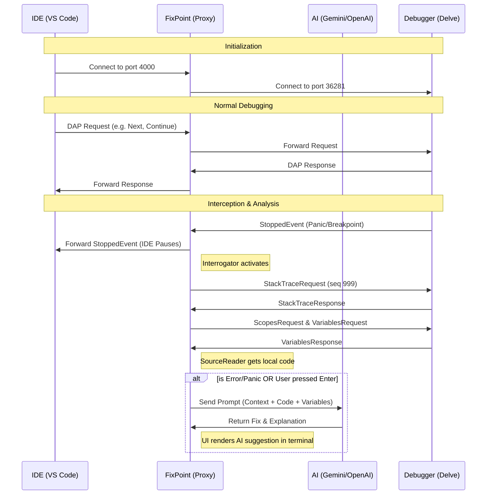

# High Level Design (HLD): FixPoint Architecture

FixPoint acts as a man-in-the-middle (MITM) proxy between your Integrated Development Environment (IDE) and your Debug Adapter Protocol (DAP) server (e.g., Go's Delve). By sitting in the middle of the communication stream, it can seamlessly intercept events, interrogate the debugger for context, and pass that context to an AI for analysis—all without modifying your IDE or debugger.

Here is a breakdown of how the system works end-to-end.

---

## 1. System Components

### A. The IDE (e.g., VS Code)
The user's code editor, which sends debugging commands (like `step over`, `continue`, `evaluate`) and expects debugger responses.

### B. FixPoint (The Proxy)
The core application. It has several sub-components:
- **Proxy Server (`proxy.go`)**: Manages TCP connections. It accepts connections from the IDE and dials the target Debugger.
- **DAP Stream Processor (`proxy.go`)**: Reads, parses, and forwards DAP messages in both directions (IDE -> Debugger and Debugger -> IDE).
- **Interrogator (`interrogator.go`)**: Injects its own DAP requests into the stream to fetch variables, stack traces, and scopes when the program stops.
- **Source Reader (`source.go`)**: Reads the user's local source code files to extract the exact code snippet where the execution stopped.
- **AI Module (`ai.go`)**: Communicates with external LLM APIs (Gemini, OpenAI, OpenRouter) to analyze the captured context.

### C. The Debugger (e.g., Delve)
The actual DAP backend running the user's application. It executes the code, manages breakpoints, and reports back when the program stops (e.g., due to a panic or breakpoint).

---

## 2. End-to-End Execution Flow

### Initialization Phase
1. **Start**: The user runs `fixpoint`. The application (`main.go`) starts listening on a designated proxy port (default `4000`).
2. **Debugger Setup**: `fixpoint` either automatically spawns a headless Delve debugger instance or connects to an existing one specified by the user.
3. **IDE Connection**: The user starts debugging in their IDE, which is configured to attach to `localhost:4000`.
4. **Session Establised**: The `Proxy` accepts the IDE connection, establishes a connection to the Debugger, and spawns two goroutines to forward traffic bidirectionally.

### The Normal Run Phase
- As the user clicks "Step Over" or "Continue" in their IDE, the DAP requests flow: `IDE -> Proxy -> Debugger`.
- The responses flow back: `Debugger -> Proxy -> IDE`.
- To the IDE, it looks exactly as if it is connected directly to the Debugger.

### The Interception Phase (When a Crash or Breakpoint Occurs)
1. **Stopped Event**: The Debugger hits a breakpoint, encounters a panic, or catches an exception. It sends a `StoppedEvent` DAP message.
2. **Detection**: The `DAP Stream Processor` (`Debugger->IDE` direction) sees the `StoppedEvent`. It forwards the event to the IDE normally so the UI updates, but it also triggers the `Interrogator`.
3. **Context Capture (`Interrogator`)**:
   - The Interrogator needs to know *why* the program stopped and *what* the state is. 
   - It injects custom DAP requests (`StackTraceRequest`, `ScopesRequest`, `VariablesRequest`) directly into the `Proxy -> Debugger` stream.
   - It assigns these custom requests very high sequence numbers (starting from `999`) so they don't collide with the sequence numbers of requests coming from the IDE.
   - The Interrogator captures the responses, extracting local variables, the call stack, and the exact thread/frame IDs.
4. **Source Code Extraction**: The Interrogator uses the `SourceReader` to open the local file where the error occurred and extracts the surrounding function's source code.
5. **AI Analysis**:
   - If it was an error/panic, FixPoint immediately constructs a prompt containing the error message, local variables, stack trace, and source code.
   - It sends this prompt to the configured AI API.
   - If it was just a regular breakpoint, FixPoint pauses and prompts the user in the terminal: *"Press [Enter] for AI analysis"*. If the user presses enter, it queries the AI.
6. **Result Display**: The AI's analysis and suggested code fixes are rendered and printed beautifully to the FixPoint terminal output using `ui.go`.

---

## 3. High Level Architecture Diagram

## Summary of Key Design Decisions
- **Non-blocking Proxy:** FixPoint does not block the IDE from receiving the `StoppedEvent`. It allows the IDE to pause and display the error normally, while FixPoint performs its heavy-lifting (fetching context and calling AI) asynchronously in the background.
- **DAP Agnosticism:** By operating at the DAP layer, FixPoint is inherently language-agnostic. While currently focused on Go, the core proxy logic works for Python (debugpy), Node.js, or any other DAP-compliant debugger.
- **Custom Sequence Injection:** To request variables without breaking the IDE's internal state, FixPoint tracks its own DAP sequence numbers and intercepts matching responses before they are accidentally forwarded to the IDE.
